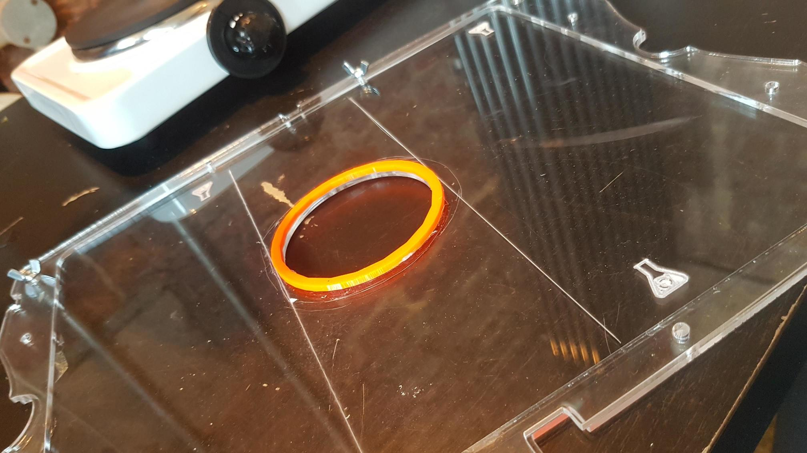
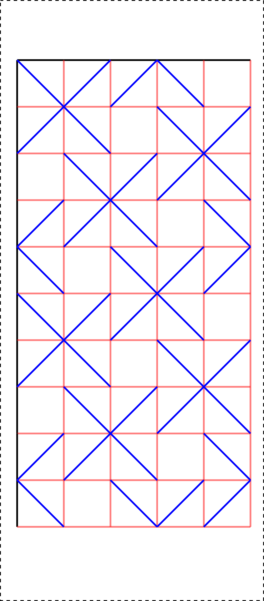

 

## About this [event](https://www.eventbrite.co.uk/e/algaebioplasticlab-feeling-for-the-organisms-workshop-tickets-383972059767) 📆

In the workshop, we'll learn how to make and use basic bioplastics with algae, water, processed extracts from red seaweed and glycerol and take part in a form of ‘critical making’, a way of developing a critical perspective on the world by hands on thinking through materials.

 * See how bioplastic can be made with domestic technology
 * Get to know the algae Euglena gracilis with a paper microscope
 * Make stuff by folding algal biomaterials
 * Understand the social relations everyday materials have with non-humans

Suitable for ages 16+

You can find this online at **[https://cheapjack.github.io/AlgaeBioPlasticLab/Workshop1](https://cheapjack.github.io/AlgaeBioPlasticLab/Workshop1)**

## Structure 📜

**Time**|**Activity**
---|---
1-1.30pm|Refreshments Introduction to project Critical Making Introduce Foldscopes Cook demo
1.30pm|Foldscope Making Slide Prep Phone viewing Advanced mould making (option)
2.30pm|Break
3.00pm|Folding bioplastic Cooking **[Ca03](https://materiom.org/recipe/206)** in pairs
4pm|End

## Introduction 

This is based on recent PhD research on interdisciplinary work and learning in biomedical science and my experience working as an artist in maker culture and experiments in Biomaterials. As we'll discuss along the way many materials we use and depend on are biomaterials in some way, or at least began to be produced using living or once-living things. My work's usually about setting up making activity people do together to discuss things, it's a form of critical making.

## Critical Making 🤔 🛠️

Critical making is a phrase coined by [Matt Ratto](https://criticalmaking.com/matt-ratto/) and used broadly by other researchers working around maker culture, such as [Garnet Hertz](http://www.conceptlab.com/criticalmaking/), and in the fields of Human Computer Interaction (HCI) that explore things like Biotic Gaming, games that use digital technology and art to play with other organisms, something I call *Interspecies Gaming*. A good example is Raphael Kim's [MouldRush](https://raphael.kim/mould-rush-1).

Critical Making is also a part of the field of Science and Technology Studies (STS) which explores the social and political implications of the historical construction of science and technology. STS challenges how our theories and methods, what we think and how we do things, partly shape the world and what it is possible to know about. Critical making really brings these theories and methods together and tries to think like STS *through* making. So today we're doing a bunch of activity to think about the limits and implication of Biomaterials

## Biomaterials 🦠i🧱

Biomaterials like bioplastic are sustainable alternatives to the plastic materials we use everyday that are connected to fossil fuel use. As we'll see they still are based on extractive processes - like oil, large amounts of living, non-living and once-living things have to be gathered together and processed so you can mix them together and make something new. However they are more sustainable and arguably use alot less carbon and reduce pollution. As we'll see when we make our algae bioplastic, they have advantages and disadvantages  

There are alot of guides to make bioplastics on the web but the  [Materiom Project](https://materiom.org/) project compiles and invites contributions from bioplastic engineers and enthusiasts so that they can standardise the recipes and document their properties, tensile strength, pH, resistance to water etc. Standardisation is a big part of scaling up experimental materials so they start being used in the 'real' world. [Aled Deakin's Bio-hybrid materials](https://www.deakinbio.com) are a great example of small scale experimentation on the edge of scaling up into some kind of manufacturing process. That's the difficult part and maybe one day we can do a workshop on that, 

## Feeling for the Organisms 🦠 ❤️

Feeling for the Organisms is a fascinating book by Evelyn Fox Keller about geneticist Barbara McClintock.  When you spend time with materials, especially living material like we all do, you get a complex kind of knowledge about them, than say reading about them in a book. Today we'll get to know the Algae, *Euglena gracilis* by trying to see them with a *Foldscope* microscope, so when we use processed, dehydrated and most importantly *dead* Spirulina to colour our bioplastic later we've actually got a feeling for the organisms and materials we make and then use. I'd argue in our world of advanced capitalism we sometimes lose this kind of intimate relationship with materials. We struggle to find time to build that kind of relationship being too busy to survive and work and look after each other. Maybe we dont need those kind of feelings all of the time, for not all of the materials we use but today I'd like to just imagine what that would be like. If you make stuff, do DIY or your a builder or gardener for example you already have feelings for the materials you work with, so in some ways critical making just builds on that and tries to make time to just think about it a bit more while you are making.

## Foldscopes 🔬

[Foldscopes](https://foldscope.com/pages/frequently-asked-questions) are brillinat little kits to see things at 140X magnification or more when combined with a phone. We're going to make them from a kit and then try look at some algae samples I've been growing.

### Assembly ⚙️

<iframe width="560" height="315" src="https://www.youtube.com/embed/G0EdnniUN24" title="YouTube video player" frameborder="0" allow="accelerometer; autoplay; clipboard-write; encrypted-media; gyroscope; picture-in-picture" allowfullscreen></iframe>

### Phone Viewing 📲

<iframe width="560" height="315" src="https://www.youtube.com/embed/0iRCceGCGus" title="YouTube video player" frameborder="0" allow="accelerometer; autoplay; clipboard-write; encrypted-media; gyroscope; picture-in-picture" allowfullscreen></iframe>

## First Cook ⚗️

All my recipes orginate from the [Materiom](https://materiom.org/) project who are trying to standardise biomaterial recipes from all over the world. My favourite due to ease of use and strength while also being quite forgiving if you recipe ratio's are off, is the [Carrageenan Kappa Ca03 recipe](https://materiom.org/recipe/206)

### Warning ☣️

Carrageenan Kappa is derived from Red seaweed so is quite similar to the other once-living material Spirulina Algae. All these ingredients are food grade supplements and established food additives available widely on eBay and in health food shops and the food industry. They are not known to cause allergies but if you are allergic or have reactions to seaweed or marine vegetation please take care and let us know.  We can't guarantee the ingredients might not be contaminated with other food stuffs like gluten or nuts, it depends on the supplier. If you have allergies let us know and seek further information. Basic rule is do not ingest and wash hands after our activity and don't drink the de-ionised water if you've used battery top up water..

## Instructions 📝

### Cooking Guide ⚗️ 

I've made lasercut moulds with 3mm clear acrylic and 8mm M4 bolts with M4 butterfly nuts designed to fit  a [Electriq Maxi Food Dehyrdrator](https://www.electriq.co.uk/p/edfd06/electriq-maxi-digital-food-dehydrator-with-6-collapsible-shelves-and-48-hour-timer)

You could imagine other more simple moulds - cake and baking tins and you could dehydrate in a conventional fan oven at 35 degrees celcius. Experiment at your own risk with that - it is hard to control low temperatures with kitchen ovens. The dehydrator is much safer cost under £50 but you need to look for oblong trays like the Electriq 

<iframe width="560" height="315" src="https://www.youtube.com/embed/FOFGfmVd0ps" title="YouTube video player" frameborder="0" allow="accelerometer; autoplay; clipboard-write; encrypted-media; gyroscope; picture-in-picture" allowfullscreen></iframe>

### Domestic Lab Equipment ⚗️

 * Hot Plate
 * Saucepan with insulated handle (do not re-use for food)
 * [Electriq Food Dehyrdrator](https://www.electriq.co.uk/p/edfd06/electriq-maxi-digital-food-dehydrator-with-6-collapsible-shelves-and-48-hour-timer)
 * Laser cut moulds for dehydrator [Lasercutting at DoESLiverpool](https://doesliverpool.com). You can use the cut file [BioPlasticTrays.svg here](https://github.com/cheapjack/AlgaeBioPlasticLab/blob/master/BioPlasticTrays.svg)
 * Plasticine or blue tack for internal mould walls, or 3D Print them [from this file](https://github.com/cheapjack/AlgaeBioPlasticLab/blob/master/AlgaeBioPlasticRingMould.stl)
 * Heat proof 500ml Borosilicate Glass Conical Flask - not essential but handy and safe for mixing and heating although you'll need gloves to handle them. Our recipe is realitvely low temperature when mixing so you'll see me handling without gloves.
 * Pyrex dish
 * Analogue cooking thermometer- if you can get a traditional thermometer for jam making, this is really handy.
 * Microscales
 * Scales
 * Magnetic stirrer - not essential but can help if you mixing alot - again available on ebay
 * [Foldscopes](https://foldscope.com/collections/for-everyone) - Only necessary if you want to explore the world of living algae!

### Ingredients 🛒

All of these ingredients are sourced on eBay and are food grade and non-toxic. Be careful you only get pure Carrageenan Kappa, some suppliers include it with xanthem gum which makes it far too thick for the foldable film we make here.

These are amounts enough to fill one of our moulds to give you 2 sheets of 107mm x 244mm size. The most consistent results have come from half the original amounts listed on Materiom per sheet, one at a time but you could experiment.

**Amount**|**Item**
---|---
175ml|Water (distilled and/or ionised water ideally. Battery top up water works ok)
2ml|Glycerol
8g|Carrageenan Kappa 
0.5g|Spirulina Algae

### Step 1 ⚗️ 

In a cooking pot or flask and stirring setup, pour 175 ml of water. After that, with a spoon, add little by little 8g of Carrageenan Kappa. You can also use Carrageenan Iota, however this will give you a slight variations in the final material.

Warning: We got lucky with tap water for a few cooks but found tap water to be ionsied and lead to unexpected resulte. Battery top up water about £1 a litre seemed alot more stable. Distilled water might be even better. So ignore my advice in the instructional that tap water will do! 

### Step 2 ⚗️ 🔥

Turn on the cooker to a high heat and start stirring, ideally with a rubber spatula. You can keep to a low heat if using a magnetic stirrer. Mix constantly and until you have dissolved all the lumps.

### Step 3 💉

When the mixture becomes homogeneous, add 2 ml of glycerin. Stir and mix a little longer.

### Step 4 ⚗️ 🔥🌡️

Use a thermometer and heat the mixture to 70º C. Once at 70ºC, remove thermometer and get ready to pour the mix in to your moulds. Let it cool for 30 seconds to help control it. Put pressure on the ring as you pur in as the acrylic bows upwards with the heat, after a minute it should stay flat.

### Step 5 ⏲️ 🌡️

Dry in a food dehydrator for 18hrs at 35º, but you can also air-dry the sample, which will take longer. Once the film dries, carefully peel off.

## Origami Fold designs 📄

This uses the Huffman Waterbomb Tessalation design from [Origami Simulator](https://origamisimulator.org/). Tape your BioPlastic sheet to the handout and use as a template to score the folds with a pair of scissors. Another origami resource is at [Cut Fold Templates](http://cutfoldtemplates.com)

