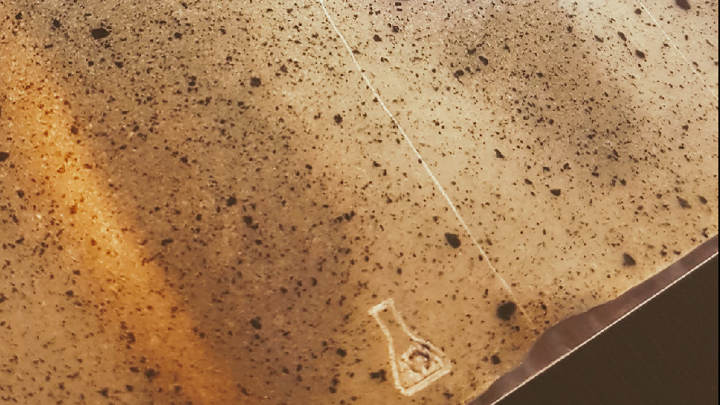

Documentation of a simple kit for making and experimenting with bioplastics for a residency at [METAL Liverpool](http://www.metalculture.com/about-us/liverpool/) 

Algae microscopy workshops, critical making, DIY Material Science

## Equipment

 * Hot Plate
 * Saucepan
 * Food Dehyrdrator
 * Laser cut moulds for dehydrator [Lasercutting at DoESLiverpool](https://doesliverpool.com)
 * Plasticine or blue tack for internal mould walls
 * Camping Stove
 * Heat proof Conical Flask
 * Pyrex dish
 * [Electronic thermometer probe](https://gitlab.com/cheapjack/jacobtemperatureshrimp)
 * Microscales
 * Scales
 * Magnetic stirrer
 * Foldscopes

## Ingredients

 * Agar Agar
 * Glycerol
 * Water
 * Algae Samples
 * Carrageenan Kappa
 * Spirulina

## Recipes

 * [Agar Bioplastic Ag02](https://materiom.org/recipe/41)
 * [Carragreen Film Ca03](https://materiom.org/recipe/206)

## Tools

 * [Inkscape](https://inkscape.org/)
 * [Origami Simulator](https://origamisimulator.org/)
